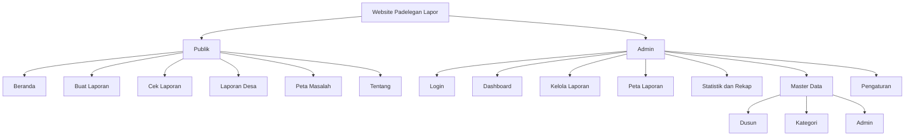
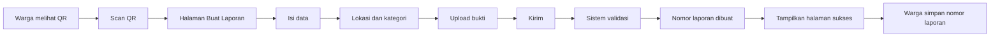
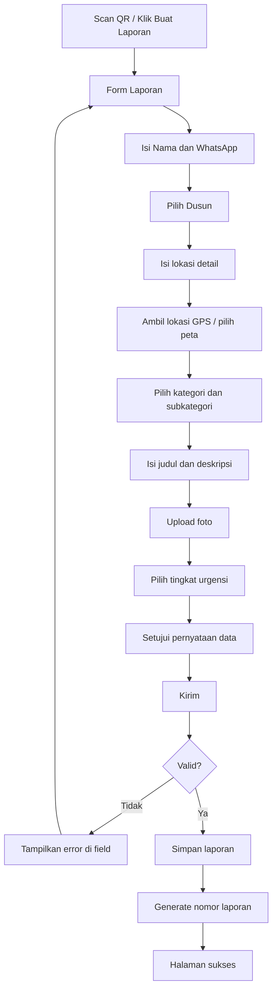
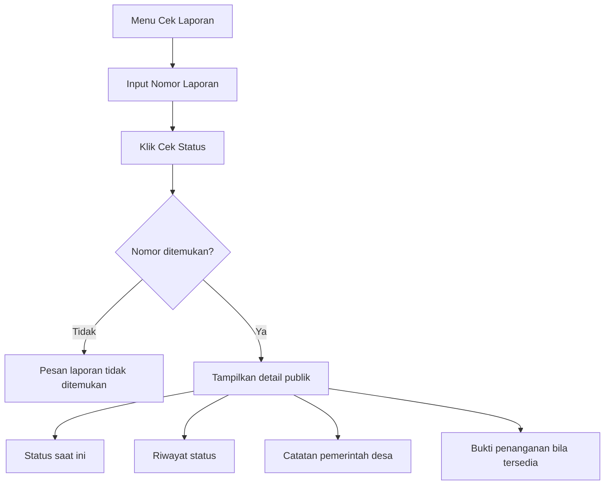
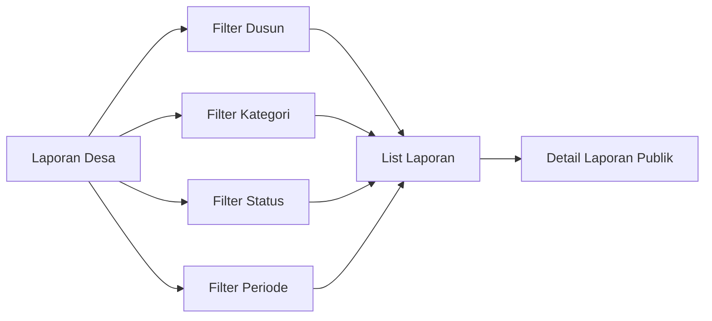
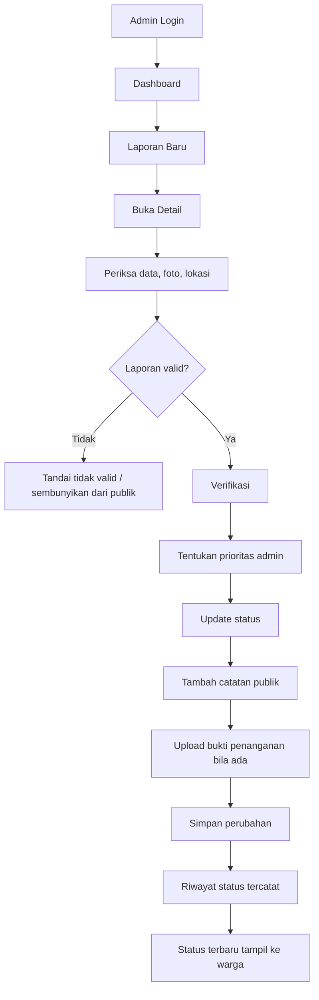
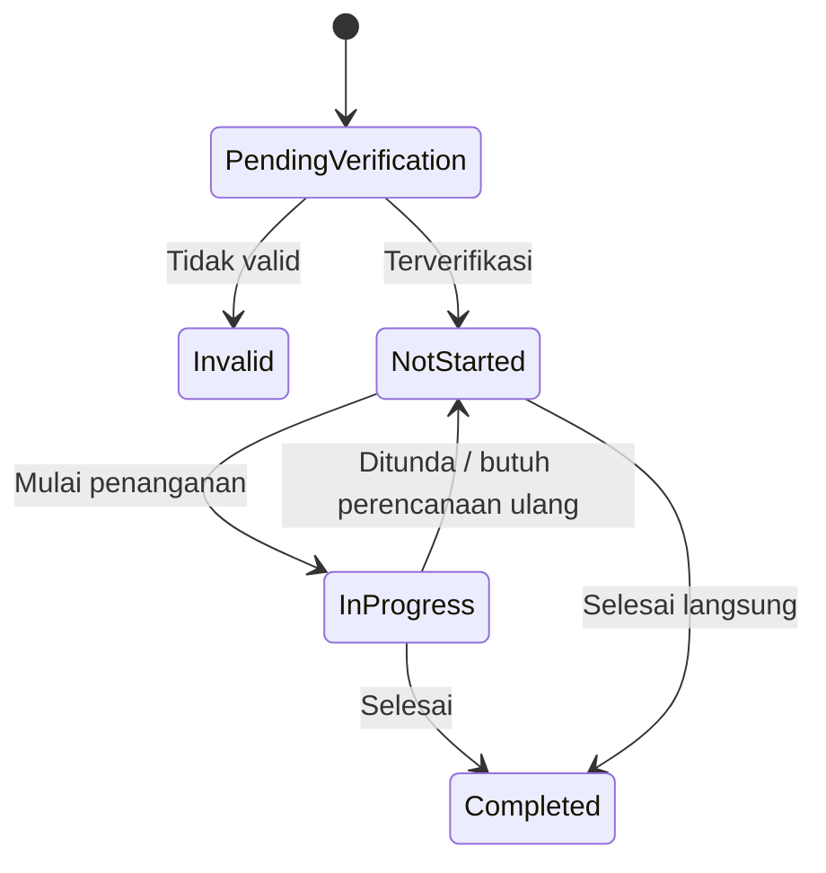
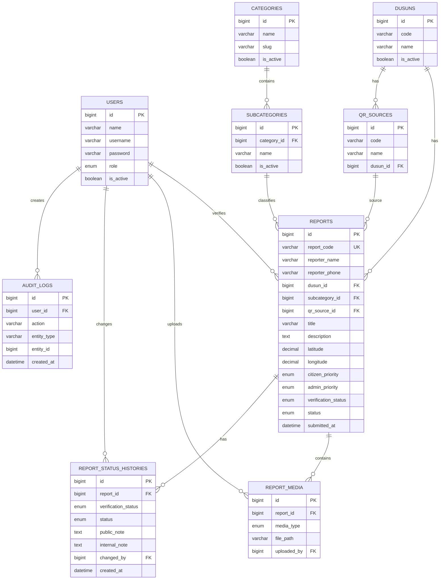
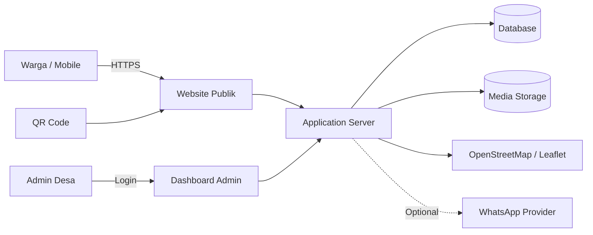

# PADELEGAN LAPOR

## Project Brief, PPL, System Requirement, Database, User Flow, dan Handover Scope

**Project:** Padelegan Lapor  
**Jenis:** Web pelaporan masyarakat Desa Padelegan  
**Target pengguna:** Masyarakat Desa Padelegan dan Pemerintah Desa  
**Konteks:** Program KKN / digitalisasi layanan pelaporan desa  
**Dokumen:** Brief teknis untuk buyer, developer, UI/UX, dan pihak desa  
**Versi:** 1.0

---

# 0. Ringkasan Eksekutif

Padelegan Lapor adalah website pelaporan masyarakat yang memudahkan warga menyampaikan masalah fasilitas, lingkungan, infrastruktur, pelayanan desa, dan aspirasi tanpa harus membuat akun.

Alur utama dibuat sesingkat mungkin:

> Warga melihat QR Code -> scan -> langsung masuk halaman Buat Laporan -> isi data dan bukti -> kirim -> memperoleh Nomor Laporan -> Pemerintah Desa memverifikasi dan memperbarui status -> warga mengecek perkembangan laporan.

Website dibagi menjadi dua area utama:

1. **Website Publik / Masyarakat**
   - Beranda
   - Buat Laporan
   - Cek Laporan
   - Laporan Desa
   - Peta Masalah
   - Tentang

2. **Dashboard Pemerintah Desa / Admin**
   - Login
   - Dashboard statistik
   - Kelola laporan
   - Detail dan verifikasi laporan
   - Update status dan bukti penanganan
   - Peta laporan
   - Statistik dan rekap
   - Export laporan hasil akhir
   - Master data
   - Pengaturan

Fokus MVP adalah **pelaporan cepat, status transparan, dashboard admin yang mudah digunakan, dan rekap hasil akhir yang dapat dipresentasikan saat penutupan KKN**.

---

# 1. Latar Belakang Masalah

Masalah yang ingin diselesaikan:

- Pengaduan warga sering disampaikan secara lisan atau melalui chat pribadi sehingga sulit direkap.
- Pemerintah desa sulit melihat masalah mana yang belum, sedang, atau sudah ditangani.
- Tidak ada nomor laporan yang dapat dipakai warga untuk mengecek tindak lanjut.
- Dokumentasi foto sebelum dan sesudah penanganan belum terpusat.
- Data masalah per dusun, kategori, dan periode sulit dirangkum menjadi laporan akhir.
- Kanal pelaporan harus dapat digunakan oleh warga yang tidak terbiasa membuat akun atau menggunakan aplikasi kompleks.

Padelegan Lapor menyatukan proses tersebut ke dalam satu sistem sederhana.

---

# 2. Tujuan Sistem

## 2.1 Tujuan Utama

1. Mempermudah masyarakat mengirim laporan.
2. Membantu Pemerintah Desa mencatat dan menindaklanjuti laporan.
3. Menyediakan status laporan yang dapat dipantau masyarakat.
4. Memetakan permasalahan berdasarkan dusun dan lokasi.
5. Menyediakan dokumentasi sebelum dan sesudah penanganan.
6. Membuat data pelaporan dapat direkap menjadi laporan hasil akhir.

## 2.2 Indikator Keberhasilan

Sistem dianggap berhasil apabila:

- warga dapat mengirim laporan dari HP tanpa login;
- laporan mendapatkan nomor unik otomatis;
- admin dapat memverifikasi dan mengubah status;
- perubahan status tercatat dalam riwayat;
- masyarakat dapat mengecek laporan menggunakan nomor laporan;
- identitas pelapor tidak muncul di halaman publik;
- dashboard menampilkan statistik otomatis;
- data dapat difilter dan diekspor untuk laporan akhir.

---

# 3. Prinsip Produk

1. **Cepat**: dari scan QR sampai form laporan maksimal 1 langkah navigasi.
2. **Mudah**: form menggunakan bahasa sederhana dan mobile first.
3. **Transparan**: setiap laporan memiliki status dan riwayat.
4. **Aman**: nama dan WhatsApp tidak tampil ke publik.
5. **Terukur**: seluruh laporan dapat dihitung berdasarkan dusun, kategori, prioritas, status, dan periode.
6. **Mudah dirawat**: master dusun dan kategori dapat diubah admin tanpa mengedit source code.

---

# 4. Scope Project

## 4.1 MVP Wajib

### Website masyarakat

- Beranda
- Form Buat Laporan
- Scan QR langsung menuju form
- Upload foto bukti
- Input/pilih lokasi
- Nomor laporan otomatis
- Cek status laporan
- Daftar laporan publik
- Detail laporan publik
- Peta masalah
- Halaman Tentang

### Dashboard admin

- Login admin
- Dashboard statistik
- List seluruh laporan
- Search dan filter
- Detail laporan
- Verifikasi laporan
- Update status
- Catatan/keterangan pemerintah desa
- Upload bukti penanganan
- Riwayat status
- Peta laporan
- Statistik
- Export CSV/XLSX/PDF atau print view
- Master dusun
- Master kategori
- Pengaturan identitas website

## 4.2 Phase 2 / Opsional

Tidak wajib untuk MVP dan sebaiknya dihitung sebagai add-on jika buyer meminta:

- Notifikasi WhatsApp otomatis
- OTP WhatsApp
- Email notifikasi
- Multi admin dengan approval berjenjang
- Penugasan laporan ke petugas tertentu
- SLA dan deadline penanganan
- Komentar dua arah warga dan admin
- Progressive Web App
- Push notification
- Integrasi website desa
- Integrasi Google Maps berbayar
- Analitik lanjutan
- Backup otomatis ke cloud

---

# 5. Aktor dan Hak Akses

| Aktor | Login | Fungsi Utama | Akses Data Pribadi |
|---|---|---|---|
| Masyarakat | Tidak | Membuat laporan, cek status, melihat laporan publik, melihat peta | Hanya data miliknya saat input |
| Admin Desa | Ya | Verifikasi, update status, catatan, bukti penanganan, statistik | Ya |
| Super Admin | Ya | Semua akses admin + kelola akun dan pengaturan sistem | Ya |

> Jika project ingin lebih sederhana, role **Admin Desa** dan **Super Admin** dapat digabung menjadi satu role pada MVP.

---

# 6. Sitemap



---

# 7. QR Code Flow

## 7.1 Tujuan

QR Code ditempel pada titik yang mudah dilihat warga, misalnya balai desa, balai dusun, papan informasi, posko KKN, atau media sosial.

## 7.2 Link QR

### Pilihan paling sederhana

```text
https://domain-desa.id/lapor?source=qr
```

### Pilihan lebih baik, per lokasi/dusun

```text
https://domain-desa.id/lapor?qr=DSN01
```

Dengan model per lokasi, sistem dapat mencatat QR mana yang paling sering digunakan.

## 7.3 Alur QR



## 7.4 Rekomendasi UX QR

Setelah scan QR:

- jangan diarahkan ke homepage dulu;
- langsung ke `/lapor`;
- field dusun dapat otomatis terisi bila QR dibuat khusus per dusun;
- tampilkan progress form;
- tombol kirim dibuat besar dan mudah dijangkau di HP;
- setelah sukses ada tombol **Salin Nomor Laporan** dan **Cek Status**.

---

# 8. User Flow Masyarakat

## 8.1 Flow Membuat Laporan



## 8.2 Flow Cek Laporan



## 8.3 Flow Melihat Laporan Desa



---

# 9. User Flow Admin



---

# 10. Lifecycle / Status Laporan

Agar tetap mengikuti konsep tiga status utama tetapi proses admin lebih aman, gunakan dua layer status.

## 10.1 Status Verifikasi Internal

| Status | Arti |
|---|---|
| `pending` | Laporan baru, belum diperiksa admin |
| `verified` | Laporan valid dan dapat diproses |
| `invalid` | Spam, duplikat, data tidak sesuai, atau tidak dapat diverifikasi |

## 10.2 Status Publik

| Status | Label UI | Arti |
|---|---|---|
| `not_started` | Belum Terlaksana | Belum masuk proses pelaksanaan / masih menunggu tindak lanjut |
| `in_progress` | Proses Pelaksanaan | Sedang ditangani atau dikoordinasikan |
| `completed` | Sudah Terlaksana | Penanganan dinyatakan selesai |

## 10.3 State Diagram



## 10.4 Catatan Penting

- Setiap perubahan status wajib membuat **status history**.
- Status `invalid` tidak ditampilkan ke daftar publik.
- Untuk status `completed`, admin disarankan mengunggah foto sesudah penanganan.
- Untuk status `not_started` yang lama, admin wajib dapat memberikan alasan/keterangan.

---

# 11. Spesifikasi Halaman Publik

## 11.1 Beranda

### Tujuan

Menjelaskan fungsi website dan mengarahkan warga ke aksi utama.

### Section

1. Navbar
2. Hero
3. CTA Buat Laporan
4. CTA Cek Laporan
5. Statistik singkat
6. Laporan terbaru
7. Cara kerja 3 sampai 4 langkah
8. Manfaat layanan
9. CTA akhir
10. Footer

### Statistik

- Total laporan
- Sudah terlaksana
- Proses pelaksanaan
- Belum terlaksana

### Data

Semua statistik harus berasal dari database, bukan angka hardcoded.

---

## 11.2 Buat Laporan

### Form field

| Field | Tipe | Wajib | Catatan |
|---|---|---:|---|
| Nama Pelapor | text | Ya | Tidak ditampilkan publik |
| Nomor WhatsApp | tel | Ya | Validasi format Indonesia |
| Dusun | select | Ya | Data dari master dusun |
| Lokasi Detail | textarea | Ya | Patokan lokasi |
| Latitude | decimal | Opsional | Dari GPS/peta |
| Longitude | decimal | Opsional | Dari GPS/peta |
| Kategori | select/card | Ya | Data master |
| Subkategori | select | Ya | Bergantung kategori |
| Judul Laporan | text | Ya | Maks. 120 karakter |
| Deskripsi | textarea | Ya | Min. karakter disarankan |
| Foto | file | Ya | Minimal 1 untuk MVP |
| Video | file | Opsional | Sebaiknya Phase 2 karena storage |
| Urgensi Warga | radio | Ya | Biasa, Penting, Darurat |
| Persetujuan | checkbox | Ya | Data benar dan boleh diproses |

### Validasi file

- Format foto: JPG, JPEG, PNG, WEBP
- Maksimal 5 foto
- Maksimal file disarankan 3 sampai 5 MB per foto
- Compress gambar di server/client jika memungkinkan
- Nama file tidak menggunakan nama asli user

---

## 11.3 Halaman Sukses

Setelah laporan masuk:

```text
LAPORAN BERHASIL DIKIRIM
Nomor Laporan: PDL-2026-X7K9Q2

Simpan nomor ini untuk mengecek perkembangan laporan.
```

Tombol:

- Salin Nomor
- Cek Status
- Kembali ke Beranda

### Rekomendasi nomor laporan

Jangan hanya memakai angka urut yang mudah ditebak. Format lebih aman:

```text
PDL-2026-X7K9Q2
```

Database tetap memiliki `id` numerik internal, sedangkan masyarakat menggunakan `report_code` acak dan unik.

---

## 11.4 Cek Laporan

Input:

- Nomor laporan

Output:

- Nomor laporan
- Judul
- Dusun
- Kategori
- Tanggal
- Status
- Keterangan admin
- Riwayat
- Foto sebelum
- Foto sesudah bila ada

Tidak ditampilkan:

- Nama pelapor
- Nomor WhatsApp
- IP address
- Catatan internal admin

---

## 11.5 Laporan Desa

### Fungsi

Pusat transparansi seluruh laporan yang sudah dinyatakan valid.

### Filter

- Keyword
- Dusun
- Kategori
- Status
- Prioritas
- Bulan/periode

### Card/Table publik

- Judul
- Dusun
- Kategori
- Status
- Tanggal
- Thumbnail opsional

### Privacy

Identitas pelapor tidak pernah tampil di publik.

---

## 11.6 Peta Masalah

### Teknologi rekomendasi

- Leaflet.js
- OpenStreetMap

Keuntungan: dapat digunakan tanpa biaya API Google Maps untuk kebutuhan sederhana.

### Marker

- Merah: Belum Terlaksana
- Kuning: Proses Pelaksanaan
- Hijau: Sudah Terlaksana

### Privacy lokasi

Jika titik laporan berada di rumah warga, jangan tampilkan koordinat presisi ke publik. Pilihan implementasi:

- marker publik dibuat sedikit ter-offset;
- hanya tampilkan area/dusun;
- koordinat presisi hanya admin yang melihat.

---

## 11.7 Tentang

Isi:

- Apa itu Padelegan Lapor
- Tujuan
- Cara menggunakan
- Informasi bahwa layanan merupakan hasil/dukungan program KKN jika disetujui desa
- Kontak pemerintah desa
- Disclaimer penggunaan data

---

# 12. Spesifikasi Dashboard Admin

## 12.1 Dashboard Utama

### KPI Cards

- Total laporan
- Laporan baru/pending
- Belum terlaksana
- Proses pelaksanaan
- Sudah terlaksana
- Laporan prioritas tinggi

### Grafik

- Laporan per bulan
- Laporan per dusun
- Laporan per kategori
- Laporan berdasarkan status

### Widget

- 5 laporan terbaru
- 5 laporan prioritas tinggi
- 5 laporan yang paling lama belum selesai

---

## 12.2 Kelola Laporan

Tabel:

| Kolom | Keterangan |
|---|---|
| Nomor Laporan | Kode publik |
| Tanggal | Waktu laporan masuk |
| Judul | Judul laporan |
| Dusun | Lokasi administratif |
| Kategori | Jenis laporan |
| Urgensi | Dari warga/admin |
| Verifikasi | Pending, Verified, Invalid |
| Status | Belum, Proses, Selesai |
| Aksi | Detail |

Filter admin:

- Keyword
- Tanggal
- Dusun
- Kategori
- Status
- Verifikasi
- Prioritas

---

## 12.3 Detail Laporan Admin

Admin melihat:

- nomor laporan;
- waktu laporan masuk;
- nama pelapor;
- nomor WhatsApp;
- dusun;
- alamat/lokasi detail;
- koordinat;
- peta;
- kategori/subkategori;
- judul;
- deskripsi;
- foto sebelum;
- urgensi warga;
- prioritas admin;
- status verifikasi;
- status pelaksanaan;
- catatan publik;
- catatan internal;
- riwayat update;
- bukti penanganan.

Aksi:

- verifikasi;
- tandai invalid;
- ubah prioritas;
- ubah status;
- tambah catatan;
- upload foto sesudah;
- simpan.

---

# 13. Laporan Hasil Akhir

Fitur ini penting untuk kebutuhan presentasi KKN dan dokumentasi desa.

## 13.1 Filter Rekap

- Tanggal mulai
- Tanggal akhir
- Dusun
- Kategori
- Status
- Prioritas

## 13.2 Isi Rekap

### Ringkasan

- jumlah total laporan;
- jumlah selesai;
- jumlah proses;
- jumlah belum;
- persentase penyelesaian;
- kategori terbanyak;
- dusun dengan laporan terbanyak.

### Detail

- nomor;
- tanggal;
- judul;
- dusun;
- kategori;
- prioritas;
- status;
- tanggal selesai;
- keterangan penanganan.

## 13.3 Export

Minimal salah satu:

- CSV/XLSX untuk olah data;
- print friendly HTML;
- PDF rekap.

Jika budget terbatas, MVP paling aman adalah **CSV/XLSX + halaman print**. PDF otomatis dapat menjadi add-on.

---

# 14. Functional Requirements

Gunakan ID berikut untuk komunikasi antara buyer dan developer.

| ID | Requirement | Priority |
|---|---|---|
| FR-01 | Sistem menampilkan homepage publik | Must |
| FR-02 | Warga dapat membuka form langsung dari QR | Must |
| FR-03 | Warga dapat mengirim laporan tanpa akun | Must |
| FR-04 | Sistem memvalidasi form laporan | Must |
| FR-05 | Sistem menyimpan minimal 1 foto laporan | Must |
| FR-06 | Sistem membuat nomor laporan unik | Must |
| FR-07 | Warga dapat mengecek laporan dengan nomor laporan | Must |
| FR-08 | Sistem menampilkan riwayat status | Must |
| FR-09 | Publik dapat melihat daftar laporan valid | Must |
| FR-10 | Publik dapat melakukan filter laporan | Must |
| FR-11 | Publik dapat melihat peta masalah | Must |
| FR-12 | Admin dapat login | Must |
| FR-13 | Admin dapat melihat seluruh laporan | Must |
| FR-14 | Admin dapat memverifikasi laporan | Must |
| FR-15 | Admin dapat mengubah status | Must |
| FR-16 | Admin dapat menulis catatan publik | Must |
| FR-17 | Admin dapat menulis catatan internal | Should |
| FR-18 | Admin dapat upload bukti sesudah penanganan | Must |
| FR-19 | Setiap perubahan status disimpan dalam history | Must |
| FR-20 | Dashboard menghitung statistik otomatis | Must |
| FR-21 | Admin dapat filter dan search laporan | Must |
| FR-22 | Admin dapat export rekap | Must |
| FR-23 | Admin dapat kelola master dusun | Must |
| FR-24 | Admin dapat kelola kategori/subkategori | Must |
| FR-25 | Sistem menyembunyikan identitas pelapor dari publik | Must |
| FR-26 | Sistem mencatat sumber QR | Should |
| FR-27 | Admin dapat mengelola akun admin | Should |
| FR-28 | Sistem mencatat audit log tindakan penting | Should |
| FR-29 | Sistem dapat mengirim WhatsApp otomatis | Could / Add-on |
| FR-30 | Sistem dapat menyimpan video | Could / Add-on |

---

# 15. Non Functional Requirements

| ID | Area | Requirement |
|---|---|---|
| NFR-01 | Responsive | Mobile first, tetap baik di tablet/desktop |
| NFR-02 | Performance | Halaman utama idealnya terbuka < 3 detik pada koneksi normal |
| NFR-03 | Security | Password admin wajib di-hash |
| NFR-04 | Security | Admin route dilindungi authentication middleware |
| NFR-05 | Security | Validasi upload dan MIME type |
| NFR-06 | Security | CSRF protection untuk form |
| NFR-07 | Security | Rate limit form publik untuk mengurangi spam |
| NFR-08 | Privacy | Data nama/WA tidak boleh muncul di publik |
| NFR-09 | Availability | Error page dan fallback saat peta/GPS gagal |
| NFR-10 | Maintainability | Master data tidak hardcoded |
| NFR-11 | Backup | Database dan folder upload dapat dibackup |
| NFR-12 | Accessibility | Label form jelas, ukuran tombol mobile memadai |
| NFR-13 | Browser | Chrome/Edge/Firefox/Safari versi modern |
| NFR-14 | Logging | Error penting dicatat server-side |

---

# 16. Business Rules

1. Masyarakat tidak perlu register/login.
2. Minimal satu bukti foto disarankan wajib untuk laporan masalah fisik.
3. Nomor laporan bersifat unik.
4. Hanya laporan `verified` yang muncul pada Laporan Desa dan Peta Masalah.
5. Identitas pelapor hanya dapat dilihat admin.
6. Setiap perubahan status membuat satu record history.
7. Status selesai disarankan memiliki bukti foto sesudah.
8. Admin dapat mengubah prioritas yang diusulkan warga.
9. Data dusun dan kategori harus diambil dari master database.
10. Penghapusan laporan sebaiknya menggunakan soft delete atau minimal audit log.
11. Laporan invalid tidak dihapus langsung agar masih dapat diaudit.
12. Sumber QR disimpan jika parameter QR tersedia.

---

# 17. Database Design

## 17.1 Database Rekomendasi

- MySQL 8+ atau MariaDB untuk hosting desa/shared hosting.
- PostgreSQL juga sangat baik bila server mendukung.

Untuk project KKN dan deployment sederhana, **MySQL/MariaDB** biasanya paling mudah.

---

## 17.2 Daftar Tabel

### 1. `users`

Akun admin.

| Field | Type | Rule |
|---|---|---|
| id | bigint | PK |
| name | varchar(100) | required |
| username | varchar(80) | unique |
| email | varchar(150) | nullable/unique |
| password | varchar(255) | hashed |
| role | enum | admin, super_admin |
| is_active | boolean | default true |
| last_login_at | datetime | nullable |
| created_at | datetime | |
| updated_at | datetime | |

### 2. `dusuns`

Master dusun. Jangan hardcode nama dusun sebelum pihak desa memberikan daftar resmi.

| Field | Type | Rule |
|---|---|---|
| id | bigint | PK |
| code | varchar(20) | unique |
| name | varchar(100) | required |
| description | text | nullable |
| is_active | boolean | default true |
| created_at | datetime | |
| updated_at | datetime | |

### 3. `categories`

| Field | Type | Rule |
|---|---|---|
| id | bigint | PK |
| name | varchar(100) | required |
| slug | varchar(120) | unique |
| icon | varchar(50) | nullable |
| sort_order | int | default 0 |
| is_active | boolean | default true |
| created_at | datetime | |
| updated_at | datetime | |

Contoh: Fasilitas Desa, Lingkungan, Infrastruktur, Pelayanan Desa, Aspirasi Masyarakat.

### 4. `subcategories`

| Field | Type | Rule |
|---|---|---|
| id | bigint | PK |
| category_id | bigint | FK categories.id |
| name | varchar(120) | required |
| slug | varchar(140) | |
| is_active | boolean | default true |
| created_at | datetime | |
| updated_at | datetime | |

### 5. `qr_sources`

Mencatat asal QR jika QR dibuat per dusun/lokasi.

| Field | Type | Rule |
|---|---|---|
| id | bigint | PK |
| code | varchar(50) | unique |
| name | varchar(120) | required |
| dusun_id | bigint | nullable FK |
| placement | varchar(200) | nullable |
| is_active | boolean | default true |
| created_at | datetime | |
| updated_at | datetime | |

### 6. `reports`

Tabel utama laporan.

| Field | Type | Rule |
|---|---|---|
| id | bigint | PK internal |
| report_code | varchar(30) | unique, public |
| reporter_name | varchar(120) | private |
| reporter_phone | varchar(30) | private |
| dusun_id | bigint | FK dusuns.id |
| subcategory_id | bigint | FK subcategories.id |
| qr_source_id | bigint | nullable FK qr_sources.id |
| title | varchar(120) | required |
| description | text | required |
| location_text | varchar(255) | required |
| latitude | decimal(10,7) | nullable |
| longitude | decimal(10,7) | nullable |
| citizen_priority | enum | normal, important, emergency |
| admin_priority | enum | nullable |
| verification_status | enum | pending, verified, invalid |
| status | enum | not_started, in_progress, completed |
| current_public_note | text | nullable |
| verified_by | bigint | nullable FK users.id |
| verified_at | datetime | nullable |
| completed_at | datetime | nullable |
| submitted_at | datetime | required |
| created_at | datetime | |
| updated_at | datetime | |
| deleted_at | datetime | nullable soft delete |

### 7. `report_media`

Semua media laporan dan penanganan.

| Field | Type | Rule |
|---|---|---|
| id | bigint | PK |
| report_id | bigint | FK reports.id |
| media_type | enum | before_photo, after_photo, video |
| file_path | varchar(255) | required |
| mime_type | varchar(100) | |
| file_size | bigint | |
| caption | varchar(255) | nullable |
| uploaded_by | bigint | nullable FK users.id |
| created_at | datetime | |

`uploaded_by = null` dapat berarti media dikirim masyarakat.

### 8. `report_status_histories`

Riwayat perubahan status.

| Field | Type | Rule |
|---|---|---|
| id | bigint | PK |
| report_id | bigint | FK reports.id |
| verification_status | enum | nullable |
| status | enum | required |
| public_note | text | nullable |
| internal_note | text | nullable |
| changed_by | bigint | nullable FK users.id |
| created_at | datetime | required |

### 9. `audit_logs`

Untuk aktivitas penting admin.

| Field | Type | Rule |
|---|---|---|
| id | bigint | PK |
| user_id | bigint | nullable FK users.id |
| action | varchar(100) | login, update_status, edit_master, dll |
| entity_type | varchar(100) | report, user, setting |
| entity_id | bigint | nullable |
| meta | json/text | nullable |
| ip_address | varchar(45) | nullable |
| created_at | datetime | required |

### 10. `settings`

| Field | Type | Rule |
|---|---|---|
| id | bigint | PK |
| key | varchar(100) | unique |
| value | text | nullable |
| updated_at | datetime | |

Contoh `key`: `village_name`, `website_title`, `contact_phone`, `logo`, `report_form_open`.

---

# 18. ERD



---

# 19. Relasi Tabel Singkat

```text
users
  |-- verifies --> reports
  |-- uploads --> report_media
  |-- changes --> report_status_histories
  `-- creates --> audit_logs

dusuns
  |-- has --> reports
  `-- has --> qr_sources

categories
  `-- has --> subcategories
               `-- classifies --> reports

qr_sources
  `-- source of --> reports

reports
  |-- has many --> report_media
  `-- has many --> report_status_histories
```

---

# 20. Index Database yang Disarankan

Agar list dan filter tetap cepat:

- `reports.report_code` UNIQUE
- `reports.submitted_at` INDEX
- `reports.dusun_id` INDEX
- `reports.subcategory_id` INDEX
- `reports.status` INDEX
- `reports.verification_status` INDEX
- composite index `(verification_status, status, submitted_at)` jika data mulai besar
- `report_status_histories.report_id` INDEX
- `report_media.report_id` INDEX

---

# 21. API / Route Contract

Bagian ini opsional bila website dibuat server-rendered. Jika menggunakan REST/SPA, endpoint berikut dapat menjadi acuan.

## Public

```text
GET    /api/public/stats
GET    /api/public/reports
GET    /api/public/reports/{report_code}
GET    /api/public/dusuns
GET    /api/public/categories
POST   /api/public/reports
```

## Admin

```text
POST   /api/admin/login
POST   /api/admin/logout
GET    /api/admin/dashboard
GET    /api/admin/reports
GET    /api/admin/reports/{id}
PATCH  /api/admin/reports/{id}/verify
PATCH  /api/admin/reports/{id}/status
POST   /api/admin/reports/{id}/media
GET    /api/admin/reports/export
CRUD   /api/admin/dusuns
CRUD   /api/admin/categories
CRUD   /api/admin/subcategories
CRUD   /api/admin/qr-sources
```

---

# 22. Struktur Data Response Cek Laporan

Contoh konsep JSON:

```json
{
  "report_code": "PDL-2026-X7K9Q2",
  "title": "Lampu Jalan Mati",
  "dusun": "Dusun Padelegan",
  "category": "Fasilitas Desa",
  "subcategory": "Lampu/Penerangan Jalan",
  "status": "in_progress",
  "status_label": "Proses Pelaksanaan",
  "submitted_at": "2026-08-30T19:20:00+07:00",
  "public_note": "Sedang dikoordinasikan dengan petugas desa.",
  "history": []
}
```

Data `reporter_name` dan `reporter_phone` tidak boleh dikirim dari endpoint publik.

---

# 23. Dashboard Metrics Formula

## Total Laporan

```text
COUNT reports WHERE verification_status != invalid
```

## Sudah Terlaksana

```text
COUNT reports WHERE verification_status = verified AND status = completed
```

## Proses Pelaksanaan

```text
COUNT reports WHERE verification_status = verified AND status = in_progress
```

## Belum Terlaksana

```text
COUNT reports WHERE verification_status IN (pending, verified) AND status = not_started
```

## Persentase Penyelesaian

```text
completed / verified_reports * 100
```

---

# 24. Prioritas Laporan

Warga boleh memilih urgensi, tetapi keputusan final tetap admin.

| Level | Dari Warga | Admin | Contoh |
|---|---|---|---|
| Biasa | Ya | Bisa override | Fasilitas minor |
| Penting | Ya | Bisa override | Lampu mati di area ramai |
| Darurat | Ya | Wajib dicek | Pohon hampir tumbang, akses membahayakan |

UI dashboard sebaiknya menandai laporan `Darurat` agar mudah terlihat.

---

# 25. Keamanan dan Privasi

## 25.1 Admin

- password hash menggunakan bcrypt/Argon2;
- session aman;
- CSRF protection;
- rate limit login;
- logout;
- akun nonaktif tidak dapat login.

## 25.2 Form Publik

- server-side validation;
- rate limit berdasarkan IP/session;
- honeypot atau CAPTCHA bila spam mulai muncul;
- sanitize input;
- file upload whitelist;
- randomize filename;
- larang executable upload.

## 25.3 Data Pelapor

- nama dan WhatsApp hanya admin;
- jangan tampilkan di URL;
- jangan masukkan ke meta tag halaman publik;
- backup database harus dijaga aksesnya;
- bila screenshot dashboard dipublikasikan, blur data pribadi.

---

# 26. Rekomendasi Teknologi

## Opsi A: Paling Praktis untuk Desa / Shared Hosting

**Backend:** Laravel 12 / PHP 8.2+  
**Frontend:** Blade + Tailwind CSS atau Bootstrap  
**Database:** MySQL / MariaDB  
**Map:** Leaflet + OpenStreetMap  
**Chart:** Chart.js  
**Storage:** Local public storage atau object storage bila tersedia  
**Auth:** Laravel session auth

### Kelebihan

- mudah dipasang di banyak hosting Indonesia;
- satu codebase;
- CRUD admin cepat dibuat;
- maintenance relatif mudah;
- export dan file upload mudah.

## Opsi B: Modern Fullstack

**Frontend:** Next.js / React  
**Backend:** Next.js API / NestJS / Laravel API  
**Database:** PostgreSQL/MySQL  
**Map:** Leaflet + OpenStreetMap

Gunakan Opsi B hanya jika deployment dan maintenance buyer memang mendukung stack Node.js.

---

# 27. Struktur Folder Referensi Laravel

```text
app/
  Models/
    User.php
    Dusun.php
    Category.php
    Subcategory.php
    Report.php
    ReportMedia.php
    ReportStatusHistory.php
    QrSource.php

  Http/Controllers/
    Public/
      HomeController.php
      ReportController.php
      TrackingController.php
      MapController.php
    Admin/
      DashboardController.php
      ReportController.php
      MasterDataController.php
      ExportController.php

resources/views/
  public/
    home.blade.php
    reports/create.blade.php
    reports/success.blade.php
    reports/track.blade.php
    reports/index.blade.php
    reports/show.blade.php
    map.blade.php
    about.blade.php

  admin/
    dashboard.blade.php
    reports/index.blade.php
    reports/show.blade.php
    statistics.blade.php
    master/

storage/app/public/reports/
  before/
  after/
```

---

# 28. UI/UX Brief

## 28.1 Gaya Visual

- identitas hijau sebagai primary;
- tampilan bersih dan resmi tetapi tidak kaku;
- kontras tinggi;
- card sederhana;
- icon secukupnya;
- mobile first;
- jangan terlalu banyak menu di layar kecil.

## 28.2 Navigation Publik

Desktop:

```text
Beranda | Buat Laporan | Cek Laporan | Laporan Desa | Peta Masalah | Tentang
```

Admin tidak perlu ditampilkan di navbar publik. Akses admin cukup melalui `/admin`.

## 28.3 CTA Utama

Primary CTA: **Buat Laporan**  
Secondary CTA: **Cek Laporan**

## 28.4 Form Mobile

- satu kolom;
- section berdasarkan langkah;
- error langsung di bawah field;
- file preview;
- lokasi GPS memiliki fallback manual;
- button submit sticky opsional.

---

# 29. Wireframe Level Halaman

## Homepage

```text
[NAVBAR]

[ HERO ]
Padelegan Lapor
Penjelasan singkat
[Buat Laporan] [Cek Laporan]

[4 STAT CARDS]

[LAPORAN TERBARU]

[CARA KERJA]
1 Scan/Buka -> 2 Isi -> 3 Diproses -> 4 Pantau

[MANFAAT]

[CTA AKHIR]

[FOOTER]
```

## Buat Laporan

```text
[Header]
Buat Laporan

[1 Data Pelapor]
[2 Lokasi]
[3 Kategori]
[4 Isi Laporan]
[5 Foto]
[6 Urgensi]
[7 Persetujuan]

[KIRIM LAPORAN]
```

## Admin Detail

```text
[Nomor + Badge Status]

[Data Pelapor] [Lokasi + Peta]

[Judul + Deskripsi]

[Foto Sebelum]

[Verifikasi]
[Prioritas]
[Status]
[Catatan Publik]
[Catatan Internal]
[Upload Foto Sesudah]

[SIMPAN]

[Timeline Riwayat]
```

---

# 30. Empty, Loading, Error State

Jangan hanya desain kondisi normal.

## Empty State

- belum ada laporan;
- filter tidak menemukan data;
- belum ada bukti penanganan.

## Loading State

- skeleton statistik;
- spinner tombol submit;
- disable tombol saat request berjalan.

## Error State

- gagal mengambil GPS;
- file terlalu besar;
- jaringan terputus;
- nomor laporan tidak ditemukan;
- server gagal menyimpan;
- sesi admin habis.

---

# 31. Acceptance Criteria

## AC-01 Submit Laporan

**Given** warga membuka form  
**When** semua field wajib benar dan warga menekan Kirim  
**Then** laporan tersimpan dan sistem menampilkan nomor laporan unik.

## AC-02 Validasi

**Given** field wajib kosong  
**When** warga menekan Kirim  
**Then** sistem tidak menyimpan laporan dan menampilkan error pada field terkait.

## AC-03 Tracking

**Given** nomor laporan valid  
**When** warga mencari nomor tersebut  
**Then** sistem menampilkan status dan riwayat publik tanpa data pribadi.

## AC-04 Update Admin

**Given** admin login dan membuka laporan  
**When** admin mengubah status lalu menyimpan  
**Then** status terbaru tersimpan dan satu history baru dibuat.

## AC-05 Public Privacy

**Given** laporan dilihat dari halaman publik  
**Then** nama pelapor dan WhatsApp tidak terdapat di HTML maupun response publik.

## AC-06 Map

**Given** laporan valid memiliki koordinat  
**Then** laporan dapat muncul sebagai marker sesuai aturan privacy.

## AC-07 Export

**Given** admin memilih periode/filter  
**When** admin melakukan export  
**Then** file/print view hanya memuat data sesuai filter.

---

# 32. Test Scenario Minimal

| ID | Skenario | Expected |
|---|---|---|
| T-01 | Buka QR dari HP | Langsung ke form |
| T-02 | Submit form valid | Sukses + nomor laporan |
| T-03 | Submit tanpa foto | Ditolak jika foto wajib |
| T-04 | Upload file selain image | Ditolak |
| T-05 | Cari nomor valid | Detail muncul |
| T-06 | Cari nomor salah | Not found yang ramah |
| T-07 | Admin login benar | Dashboard |
| T-08 | Admin login salah | Ditolak |
| T-09 | Ubah status | History bertambah |
| T-10 | Tandai invalid | Tidak muncul publik |
| T-11 | Filter dusun | Hasil sesuai |
| T-12 | Statistik | Angka konsisten dengan database |
| T-13 | Buka dari mobile | Layout responsif |
| T-14 | GPS ditolak user | Form tetap dapat dikirim dengan lokasi manual |
| T-15 | Public endpoint | Tidak mengandung nama/WA |

---

# 33. Tahapan Pengerjaan

## Phase 1: Requirement dan Finalisasi Data

- konfirmasi daftar resmi dusun;
- konfirmasi kategori;
- konfirmasi status;
- konfirmasi apakah foto wajib;
- konfirmasi kebutuhan video;
- konfirmasi domain/hosting;
- konfirmasi format laporan akhir.

## Phase 2: UI/UX

- sitemap;
- user flow;
- wireframe;
- UI desktop dan mobile;
- approval buyer.

## Phase 3: Backend dan Database

- migration/database;
- authentication admin;
- master data;
- laporan;
- media;
- status history.

## Phase 4: Frontend Publik

- homepage;
- form;
- tracking;
- listing;
- peta.

## Phase 5: Dashboard

- KPI;
- laporan;
- statistik;
- export.

## Phase 6: QA

- mobile;
- validation;
- security dasar;
- role;
- file upload;
- map;
- export.

## Phase 7: Deployment dan Handover

- production deploy;
- admin credential;
- backup awal;
- dokumentasi penggunaan;
- source code handover sesuai kontrak.

---

# 34. Deliverables untuk Buyer

## Design / PPL

- Project brief
- Requirement list
- Sitemap
- User flow
- ERD
- Database schema
- UI page list
- Acceptance criteria

## Development

- Source code
- Database migration/schema
- Admin dashboard
- Website publik
- QR Code siap cetak
- Export laporan

## Handover

- URL production
- Akun admin
- README instalasi
- Panduan backup
- Panduan admin singkat
- File QR Code PNG/SVG

---

# 35. Scope yang Harus Diperjelas di Awal dengan Buyer

Sebelum coding final, minta buyer menjawab poin berikut.

1. Apa saja **nama resmi 6 dusun** di Desa Padelegan?
2. Apakah masyarakat wajib mengisi nama asli?
3. Apakah WhatsApp wajib?
4. Apakah foto minimal 1 wajib?
5. Apakah video benar-benar diperlukan?
6. Apakah lokasi GPS wajib atau opsional?
7. Apakah marker publik boleh menampilkan titik presisi?
8. Apakah laporan harus langsung tampil publik atau menunggu verifikasi admin?
9. Apakah admin hanya satu akun atau beberapa perangkat desa?
10. Apakah notifikasi WhatsApp masuk scope atau tidak?
11. Format laporan hasil akhir yang diinginkan: Excel, PDF, atau keduanya?
12. Siapa yang menyediakan domain dan hosting?
13. Siapa yang menanggung biaya domain/hosting/API pihak ketiga?
14. Apakah setelah KKN website tetap digunakan desa?
15. Siapa PIC yang memegang admin setelah serah terima?

Jawaban buyer terhadap bagian ini harus masuk ke **Scope of Work final** agar tidak terjadi penambahan fitur tanpa perubahan biaya/waktu.

---

# 36. Rekomendasi Scope of Work untuk Jasa Web

## Paket MVP yang Aman Ditawarkan

**Public:**

- Beranda
- Buat Laporan
- Cek Laporan
- Laporan Desa
- Detail Laporan
- Peta Masalah
- Tentang

**Admin:**

- Login
- Dashboard
- Kelola Laporan
- Update status
- Upload bukti
- Statistik
- Export rekap
- Master dusun/kategori

**Database:**

- users
- dusuns
- categories
- subcategories
- reports
- report_media
- report_status_histories
- qr_sources
- audit_logs
- settings

**Tidak termasuk secara default:**

- WhatsApp API
- OTP
- aplikasi Android/iOS
- hosting premium
- Google Maps API berbayar
- AI klasifikasi laporan
- live chat
- integrasi sistem pemerintahan eksternal

---

# 37. Definition of Done

Project dianggap selesai apabila:

- semua halaman MVP tersedia;
- QR membuka form dengan benar;
- form dapat digunakan dari mobile;
- laporan tersimpan ke database;
- nomor tracking dapat dipakai;
- admin dapat memproses laporan;
- histori status tercatat;
- laporan publik tidak membocorkan identitas;
- statistik menggunakan data aktual;
- export berjalan;
- aplikasi sudah dites pada production/staging;
- akun admin dan dokumentasi diserahkan.

---

# 38. Ringkasan Arsitektur



---

# 39. Kesimpulan

Padelegan Lapor tidak perlu dibuat seperti aplikasi pemerintahan yang kompleks. Nilai utamanya justru berada pada alur yang singkat dan jelas:

> **Scan -> Lapor -> Dapat Nomor -> Diproses Desa -> Pantau Status -> Masuk Rekap Hasil Akhir.**

Dengan struktur database dan flow di atas, project sudah mempunyai fondasi yang cukup kuat untuk masuk ke tahap wireframe/UI, estimasi biaya, estimasi waktu, lalu development.

Prioritas implementasi sebaiknya tetap pada empat hal:

1. form laporan yang sangat mudah digunakan warga;
2. dashboard admin yang efisien;
3. transparansi status tanpa membocorkan data pribadi;
4. rekap data yang berguna bagi Pemerintah Desa dan laporan akhir KKN.